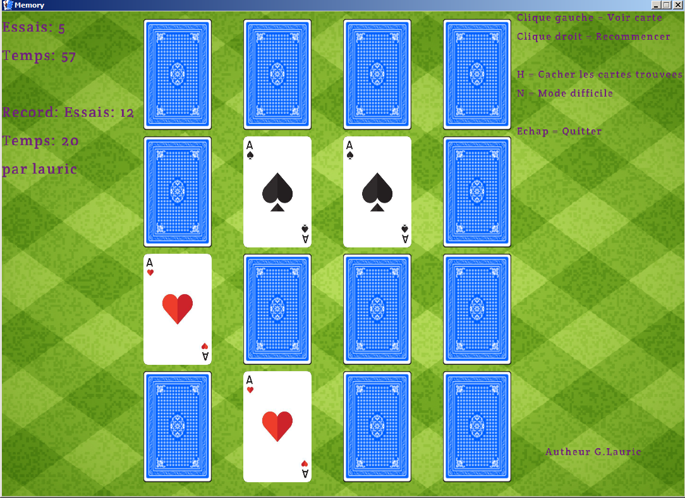
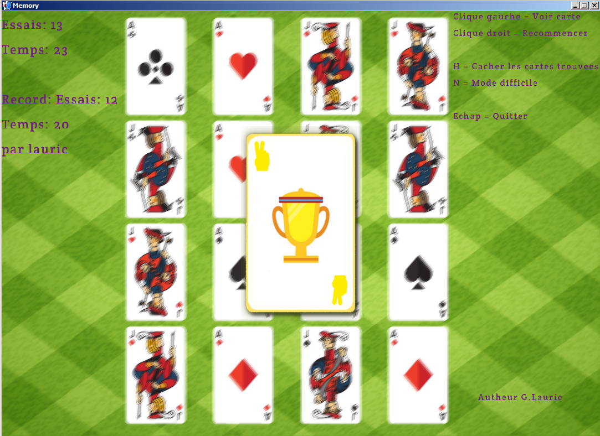

# Memory

Jeu de carte pour améliorer sa mémoire visuelle.

## Principe

Le but est de trouver toutes les paires de cartes dont les motifs sont identiques.
Lorsque le joueur fait un clique droit, toutes les cartes sont mélangées aléatoirement.

## Fonctionnalités

- Sauvegarde du meilleur score avec le temps et nom du joueur.
- Possibilité de masquer les paires trouvées.
- Mode difficile: Les cartes ne se retournent pas lorsqu'elles sont cliquées.

## Plateforme

La librairie Raylib supporte de nombreuses plateformes, à ce jour celle
qui ont été testé sont:
- Windows 7
- MacOS High Sierra (v10.13.6)

## Build

Le projet utilise la librairie [Raylib](https://www.raylib.com/).

## Motivations

J'ai programmé le jeu pour m'amuser et en apprendre davantage sur le développement de jeux.

## TODO

- Le joueur à la possibilité de changer de textures des cartes.
- Le joueur peut choisir le nombre de cartes sur le plateau.
- Rendre le jeu multiplate-forme (Windows, MacOS, Linux, Android...).